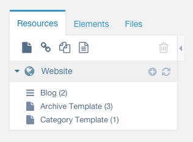

# MODX-Blog-Skeleton
Everything you need in 1 transport to start a blog on MODX Revolution 2.3.5. All Extras updated as of June 2015.

If you have a MODX Cloud Account you can alternatively email wayne@modx.com to receive a cloud snapshot. 

See: http://blog-skeleton.clients.modxcloud.com/ 

## Extras to Install

1. getResources
2. getPage
3. Collections
4. Archivist
5. Tagger

---

## MODX Themes using this blog package

1. Beetle Theme - https://github.com/dubrod/MODX-Beetle

---

## Upload the Transport

1. Extras > Installer
2. "Download Extras" Down Arrow > Upload a package > blogskeleton-1.0-pl.transport.zip
3. Install 

## Configuration

1. Friendly URLs ON
2. Content > Content Types > HTML = /
3. If you did not install the Demo Content - Create 1 Collection for your Blog, 2 Resources (Check Container Box) for Archive Container and Category Container 
4. Web Context Settings > match the values to your Archive Container, Blog Container, and Category Container

## Archivist System Setting

 - Key: archivist.archive_ids
 - name empty
 - namespace: archivist
 - area lexicon: furls
 - value: 5:arc_  (5 being resource id)

## Tagger Setup

**Extras > Tagger**

1. Groups > Create New
2. Name > Category
3. Field Type > Combo Box
4. Alias > category
5. Show for Templates > Default Blog Page Template ID 
6. Tags > Create New Tags
7. Go to a blog page and assign a tag/category so the list shows up in the Aside

###You now have a blog